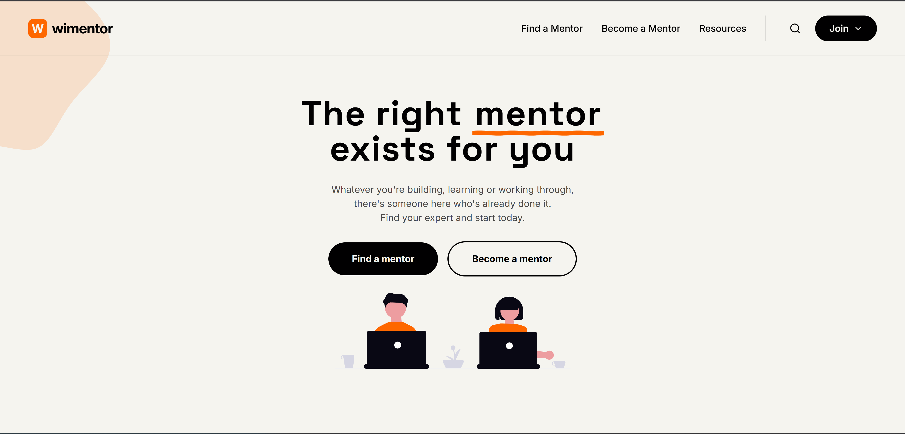

# WiMentor

> A modern mentorship platform connecting mentees with expert mentors across diverse fields of study.



---

## About

WiMentor is a web application that bridges the gap between learners and experienced mentors. Mentees can discover mentors, view their profiles, read community reviews, and join mentorship sessions. Mentors can manage their cohort of students and track reviews from a dedicated dashboard.

The platform is designed with a clean, professional aesthetic — drawing inspiration from LinkedIn-style profiles and modern dashboard UIs.

---

## Features

### For Mentees
- **Dashboard** — see an overview of active mentors and popular profiles at a glance
- **Mentor Discovery** — browse and search mentors by name, role, or field of expertise
- **Mentor Profile** — view a mentor's education background, bio, rating, and community reviews
- **Join / Leave** — follow or unfollow individual mentors independently  
- **Write Reviews** — leave a star rating and feedback directly on a mentor's profile
- **My Reviews** — track all the feedback you've submitted, with stats and filter by star rating

### For Mentors
- **Dashboard** — view stats and a summary of student enrolments
- **Students** — manage and browse the list of enrolled students
- **Reviews** — read feedback left by mentees

### Authentication
- Sign In with a shared auth flow
- Separate registration wizards for **Mentors** and **Mentees**
- Mentor registration includes a multi-step wizard (education, subject areas, and more)
- Protected routes ensure only authenticated users can access dashboards

---

## Tech Stack

| Tool | Purpose |
|------|---------|
| [React 19](https://react.dev/) | UI framework |
| [TypeScript](https://www.typescriptlang.org/) | Type safety |
| [Vite](https://vitejs.dev/) | Build tool & dev server |
| [React Router v7](https://reactrouter.com/) | Client-side routing |
| [Tailwind CSS v4](https://tailwindcss.com/) | Utility-first styling |
| [Zustand](https://zustand-demo.pmnd.rs/) | Lightweight global state (auth) |
| [Zod](https://zod.dev/) | Schema validation |
| [Lucide React](https://lucide.dev/) | Icon library |

---

## Project Structure

```
src/
├── components/
│   ├── Auth/
│   │   ├── SignIn.tsx              # Shared sign-in form
│   │   ├── signup-mentor/         # Mentor registration wizard
│   │   └── signup-mentee/         # Mentee registration form
│   ├── mentee/
│   │   ├── SideBar.tsx            # Desktop sticky sidebar for mentees
│   │   └── MobileMenu.tsx         # Bottom nav bar for mobile
│   ├── mentor/
│   └── Home/
├── layouts/
│   ├── AuthLayout.tsx             # Wraps all auth pages
│   ├── MenteeLayout.tsx           # Layout with sidebar + mobile nav
│   └── MentorLayout.tsx           # Layout for mentor dashboard
├── pages/
│   ├── Home.tsx                   # Public landing page
│   ├── Mentee/
│   │   ├── MenteeDashBoard.tsx    # Overview & popular mentors
│   │   ├── Mentors.tsx            # Mentor discovery + search
│   │   ├── MentorDetails.tsx      # Full mentor profile page
│   │   └── MyReviews.tsx          # List of reviews written by mentee
│   └── Mentor/
│       ├── DashBoard.tsx          # Mentor's overview
│       ├── Students.tsx           # Enrolled students list
│       └── Reviews.tsx            # Mentee reviews for the mentor
├── store.ts                       # Zustand auth store
├── utils/
│   └── ProtectedRoute.tsx         # Route guard for auth
└── App.tsx                        # Route definitions
```

---

## Getting Started

### Prerequisites
- [Node.js](https://nodejs.org/) v18 or higher
- npm (comes with Node)

### Installation

```bash
# Clone the repository
git clone https://github.com/your-username/wimentor.git
cd wimentor

# Install dependencies
npm install

# Start the development server
npm run dev
```

The app will be available at `http://localhost:5173`.

### Other Commands

```bash
# Type-check & build for production
npm run build

# Preview the production build locally
npm run preview

# Run the linter
npm run lint
```

---

## Routing Overview

| Path | Page | Access |
|------|------|--------|
| `/` | Home / Landing | Public |
| `/sign-in` | Sign In | Public |
| `/register-mentor` | Mentor Sign Up | Public |
| `/mentor-wizard` | Mentor Registration Wizard | Public |
| `/register-mentee` | Mentee Sign Up | Public |
| `/mentor` | Mentor Dashboard | Protected |
| `/mentor/students` | Students List | Protected |
| `/mentor/reviews` | Mentor Reviews | Protected |
| `/mentee` | Mentee Dashboard | Protected |
| `/mentee/mentors` | Browse Mentors | Protected |
| `/mentee/mentors/:id` | Mentor Profile | Protected |
| `/mentee/reviews` | My Reviews | Protected |

---

## License

This project is for educational / personal use. All rights reserved © 2025 WiMentor.
